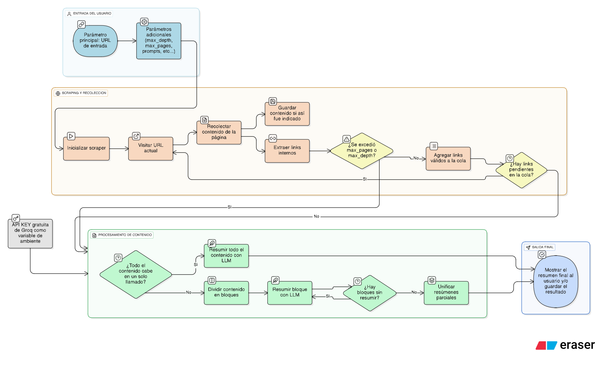

# Scrap & Analyze: Herramienta para el análisis de contenido web

Este repositorio contiene un script de Python para automatizar el proceso de _scraping_ de sitios web y el análisis de su contenido mediante Grandes Modelos de Lenguaje (LLMs). Utiliza una estrategia MapReduce para procesar grandes volúmenes de texto, garantizando un análisis profundo y coherente incluso en sitios con mucho contenido.

El sistema es resistente a fallos, con reintentos inteligentes y rotación automática de modelos LLM para maximizar la tasa de éxito.
Esta herramienta se basa en las utilidades ofrecidas por la librería crawl4AI y el servicio de Groq Cloud, que ofrece acceso a LLMs de código abierto en la nube mediante una API gratuita, o utilizando planes de pago.
- [Página web de Crawl4AI](https://docs.crawl4ai.com/)
- [Página web de Groq Cloud](https://console.groq.com/home)

## ✨ Características Principales

-   **Manejo Robusto de Errores**: Implementa una lógica de reintentos con _exponential backoff_ para gestionar errores de API y límites de tasa (_rate limiting_).
-   **Rotación Automática de Modelos**: Si un modelo LLM falla repetidamente o requiere un tiempo de espera excesivo, el sistema cambia automáticamente al siguiente modelo de una lista predefinida para no interrumpir el proceso. Esta lista de puede redefinir como parámetro de entrada
-   **Prompts Personalizables**: Permite definir plantillas de prompts específicas para la fase de análisis parcial y para la consolidación final, adaptándose a cualquier necesidad de extracción de información.
-   **División Inteligente de Texto**: El texto se divide en fragmentos (chunks) que respetan los límites de tokens del modelo definidos por el usuario, con un solapamiento configurable entre párrafos para no perder contexto.
-   **Configuración Flexible**: Múltiples parámetros ajustables, como límites de tokens, número de páginas a recolectar, profundidad de búsqueda, tiempos de espera, modelos a utilizar, etc...
-   **Modularidad**: Separación clara entre la lógica de scraping (presente en un módulo `scraper.py`) y la lógica de análisis.

## ⚙️ ¿Cómo Funciona?



El proceso sigue un flujo de trabajo claro y efectivo:

1.  **Scraping (Extracción)**: Se utiliza un módulo externo (`scraper.py`), basado en la librería crawl4ai, para navegar y extraer el contenido de las páginas de un sitio web, limpiándolo y convirtiéndolo a formato Markdown. Para más información sobre este módulo, o para usarlo de modo independiente, puede referirse a la [documentación del scraper](https://github.com/WhileTrueTry/crawler-wrapper). El tipo de sitios que pueden ser scrapeados con esta herramienta sencilla está limitado a páginas web que no se esfuerzan por evitarlo.
2.  **División (Chunking)**: El contenido de todas las páginas se combina y se divide en fragmentos de texto más pequeños (`chunks`), asegurando que cada uno quepa en el contexto del LLM y manteniendo un solapamiento para la coherencia.
3.  **Análisis Parcial**: Cada `chunk` se envía al LLM junto con un "prompt parcial". El modelo extrae la información relevante de ese fragmento específico.
4.  **Consolidación**: Todos los resúmenes parciales se juntan y se envían de nuevo al LLM con un "prompt final". En esta fase, el modelo tiene la tarea de unificar la información, eliminar redundancias y generar un informe final bien estructurado.
5.  **Reducción Recursiva**: Si el conjunto de resúmenes parciales es demasiado grande para caber en un solo llamado al LLM, el proceso de consolidación se repite en capas hasta que toda la información se pueda procesar en un solo paso final.

## 📋 Prerrequisitos

-   Python 3.8 o superior.
-   Una clave de API de [GroqCloud](https://console.groq.com/keys).

```bash
pip install crawl4ai bs4 tiktoken langchain_groq python-dotenv
```


## 🚀 Instalación y Configuración

1.  **Clona el repositorio:**
    ```bash
    git clone https://github.com/tu-usuario/tu-repositorio.git
    cd tu-repositorio
    ```

2.  **Instala las dependencias:**
    Instalar dependencias:
    ```bash
    pip install -r requirements.txt
    ```

3.  **Configurar credenciales:**
    Crea un archivo llamado `.env` en la raíz del proyecto y añade tu clave de API de Groq:
    ```
    GROQ_API_KEY="gsk_tu_api_key_aqui"
    ```

    O asegurate de establecer la variable de entorno por línea de comandos
    

## 📁 Estructura de archivos guardados

Cuando se especifican parámetros para guardar los archivos scrapeados y/o el resumen producido, se los podrá encontrar de este modo
`save_scraping` = True
`save_scraping_directory` = "mis_datos_scrapeados"
`save_summary` = True
`save_summary_directory` = "mis_resumenes"

```
[save_scraping_directory]/
├── 001_index_markdown.txt
├── 002_about_markdown.txt
└── 003_contact_markdown.txt

[save_summary_directory]/
├── organizacion_resumen.txt
```

## Usage Example

El script está diseñado para ser ejecutado desde su bloque `if __name__ == '__main__':` o importando la clase `ScrapAndAnalyze` en otro módulo. A continuación se muestra un ejemplo completo de uso.

```python
import asyncio
from scrap_and_analyze import ScrapAndAnalyze 

# 1. Definir la estructura y los prompts para guiar al LLM
#    Este ejemplo busca extraer información institucional de una ONG.

ejemplo_estructura = """
Nombre: [Nombre de la organización]
Aspectos institucionales
    • Estatus legal: [Descripción]
    • Año de creación: [Año]
    • Misión: [Texto de la misión]
    • Visión: [Texto de la visión]
    • Financiamiento: [Fuentes de financiamiento]
Producción
    • Temáticas: [Lista de temas que aborda]
    • Productos: [Informes, campañas, etc.]
Comunicación
    • Página web: [URL]
    • Redes temáticas: [Si participa en alguna]
Estructura institucional: [Tipo de estructura, ej: ONG, Fundación, etc.]
"""

prompt_parcial = """
Tu tarea es analizar un fragmento de texto extraído del sitio web de la organización "{organizacion}".
Extrae y resume la información más relevante basándote en la estructura del siguiente ejemplo.
No inventes información. Si algo no aparece en el texto, no lo incluyas.
Este es solo un trozo del contenido total. Céntrate únicamente en lo que encuentres en el texto proporcionado.

EJEMPLO DE ESTRUCTURA:
{ejemplo}

---
CONTENIDO DEL FRAGMENTO A ANALIZAR:
{contenido_chunk}
---

Extrae la información relevante de este fragmento:
"""

prompt_final = """
Eres un analista experto. Has recibido varios resúmenes parciales extraídos de diferentes páginas del sitio web de la organización "{organizacion}" ({web_oficial}).
Tu objetivo es consolidar toda esta información en un único resumen final, bien estructurado, coherente y sin redundancias.
Usa el siguiente formato como guía. No uses formato Markdown, solo texto simple.

EJEMPLO DE ESTRUCTURA FINAL:
{ejemplo}

---
RESÚMENES PARCIALES A CONSOLIDAR:
{resumenes_parciales}
---

Basándote en los resúmenes anteriores, crea el informe final y consolidado sobre la organización:
"""

# Función principal asíncrona
async def main():
    # 2. Crear una instancia de la clase
    analyzer = ScrapAndAnalyze()

    # 3. Configurar los prompts personalizados
    analyzer.set_prompts(
        partial_prompt=prompt_parcial,
        final_prompt=prompt_final,
        example=ejemplo_estructura
    )

    # 4. Ejecutar el análisis
    # Este ejemplo realiza el scraping, analiza el contenido y guarda los resultados en disco.
    print("Iniciando análisis de la organización...")
    await analyzer.analyze_organization(
        organization_name="Centro de Estudios Legales y Sociales (CELS)",
        url="https://www.cels.org.ar/web/",
        max_pages=50,  # Limita el número de páginas a scrapear
        max_depth=3,   # Profundidad máxima de enlaces a seguir
        save_scraping=True,
        save_scraping_directory="resultados/scraping_cels",
        save_summary=True,
        save_summary_directory="resultados/resumenes_cels",
        return_result=False # No necesitamos que devuelva el texto si lo estamos guardando
    )
    print("Análisis completado. Revisa la carpeta 'resultados'.")

# 5. Ejecutar el programa
if __name__ == '__main__':
    asyncio.run(main())
```


## 🛠️ Configuración Avanzada

Puedes personalizar el comportamiento de la clase ScrapAndAnalyze al momento de instanciarla:
| Parámetro             | Descripción                                                                                       | Valor por Defecto                                         |
|-----------------------|---------------------------------------------------------------------------------------------------|-----------------------------------------------------------|
| models                | Lista de modelos LLM a utilizar, en orden de preferencia.                                         | ['openai/gpt-oss-120b', 'openai/gpt-oss-20b', 'deepseek-r1-distill-llama-70b', 'qwen/qwen3-32b']      |
| token_limit           | Límite máximo de tokens por defecto.                                                    | 5000                                                      |
| chunk_size_target     | Tamaño objetivo de tokens para cada fragmento de texto. Se usa para calcular el tamaño real del chunk. | 4100                                                      |
| overlap_paragraphs    | Número de párrafos que se solaparán entre chunks consecutivos para mantener el contexto.         | 2                                                         |
| safety_margin         | Número de tokens reservados para la respuesta del modelo, evitando exceder el límite total.      | 1250                                                      |
| wait_between_chunks   | Segundos de espera entre llamadas exitosas al LLM para evitar el rate limiting.                  | 20                                                        |
| max_wait_for_switch   | Tiempo máximo (en segundos) que el script esperará por una sugerencia retry-after antes de cambiar de modelo. | 600 (10 minutos)                                         |
| temperature           | Parámetro de creatividad del LLM. 0 para respuestas más deterministas.                           | 0                                                         |


## Ejemplo de instancia con configuración personalizada:

```python
analyzer = ScrapAndAnalyze(
    models=["qwen/qwen3-32b", "deepseek-r1-distill-llama-70b"],
    token_limit=8000,
    wait_between_chunks=5,
    temperature=0.1
)
```

    

## ⚠️ Consideraciones importantes

### Limitaciones técnicas del scraper sobre el que se construye la herramienta
- Solo extrae contenido del mismo dominio
- No ejecuta JavaScript complejo
- Puede tener problemas con sitios que requieren autenticación
- No maneja CAPTCHAs automáticamente

### No olvides que los modelos LLMs pueden alucinar. 
- Los resultados tienden a ser cada vez mejores, pero la revisión humana suma un valor diferencial.

  

## 🙏 Agradecimientos

- [crawl4ai](https://github.com/unclecode/crawl4ai) - La librería principal de web crawling
- [BeautifulSoup](https://www.crummy.com/software/BeautifulSoup/) - Para el parsing de HTML
- Comunidad de Python por las increíbles herramientas disponibles
- [Groq Cloud](https://console.groq.com/home)
- [Langchain](https://www.langchain.com/)
- Comunidad de Python por las increíbles herramientas disponibles


⭐ Si este proyecto te fue útil, ¡considera darle una estrella en GitHub!

  